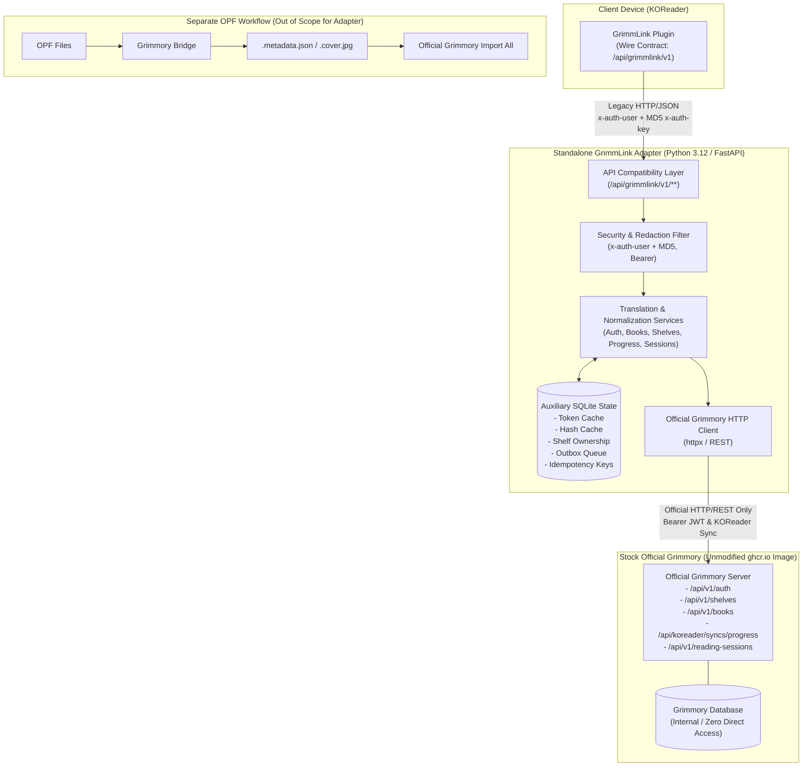

# GrimmLink Adapter — Architecture Specification

- **Version:** 0.1.0
- **Status:** Architecture Freeze (Session 00)
- **Reviewer:** GPT-5.6 Sol High

---

## 1. System Overview

**GrimmLink Adapter** is a standalone, lightweight Python service that acts as an intelligent compatibility bridge between the [GrimmLink](https://github.com/0xstillb/GrimmLink) KOReader plugin and **stock [Official Grimmory](https://github.com/grimmory-tools/grimmory)** (`v3.5.0+`).

By placing this adapter between the e-reader and Grimmory, users can decommission their custom server fork (`0xstillb/grimmory`) without modifying Official Grimmory, without writing directly to Grimmory's database, and without requiring immediate client-side rewrites on e-reader devices.

---

## 2. Architectural Invariants (Non-Negotiables)

1. **Official Grimmory Remains Stock:**
   - No source code modifications or custom forks of Grimmory.
   - Zero custom Flyway migrations in Grimmory.
   - Official Grimmory can be updated cleanly using upstream container images (`ghcr.io/grimmory-tools/grimmory`).

2. **Zero Direct Database Access:**
   - The adapter communicates with Grimmory exclusively through official HTTP REST APIs.
   - The adapter does not connect to or alter Grimmory's PostgreSQL/H2/SQLite database directly.

3. **Role of Adapter SQLite:**
   - SQLite in the adapter serves strictly as an **auxiliary cache, outbox queue, and idempotency store**.
   - Official Grimmory remains the sole source of truth for all library entities.
   - If the adapter SQLite database is wiped, it can be rebuilt from Official Grimmory without permanent library loss.

4. **Preservation of Wire Contract:**
   - Compatibility routes live **strictly** within the adapter under `/api/grimmlink/v1/**`.
   - The KOReader plugin continues to receive expected DTO shapes and status responses.

5. **Absolute Secret Masking:**
   - Sensitive credentials—including user passwords, JWT Bearer tokens, and MD5 authentication keys—are **never** logged to stdout, stderr, or log files at any log level.
   - Enforced by application-wide `SecretMaskingFilter`.

6. **OPF Processing is External:**
   - OPF parsing and metadata augmentation are completely outside the scope of `grimmlink-adapter`.
   - Handled separately by [Grimmory Bridge](https://github.com/0xstillb/grimmory-bridge) via sidecar generation.

7. **Magic Shelf Invariants:**
   - Magic Shelf removal is strictly rule-derived and read-only.
   - The adapter refuses manual book removal requests from magic shelves.

8. **Multi-Shelf Ownership Safety:**
   - Removing a book from one shelf must not cause KOReader to delete the local file if the book remains tracked by other shelves on the device.
   - Composite mapping `(book_id, shelf_id, shelf_type)` is tracked in `shelf_ownership_cache`.

9. **Progress Normalization & Calculation:**
   - Native location (CFI, XPointer) is authoritative for reflowable formats (EPUB).
   - Display percentage calculation strictly preserves page ratios:
     $$\text{Display } \% = \frac{\text{currentPage}}{\text{totalPages}} \times 100$$
     *(e.g., $55 / 16653 \approx 0.33\%$, never $33\%$)*.
   - PDF page projection and conflict semantics are preserved.

10. **Idempotency Across Retries:**
    - Reading sessions and metadata sync operations generate deterministic idempotency keys.
    - Network timeouts, retries, or restarts must not create duplicate sessions or conflicting records in Grimmory.

---

## 3. Subsystem Breakdown

### 3.1 `grimmlink_adapter.api`
- Implements the legacy `/api/grimmlink/v1` routes:
  - `GET /auth` — Authorize KOReader client.
  - `GET /capabilities` — Feature flags.
  - `GET /books/by-hash/{bookHash}` — Content hash lookup.
  - `GET /books/{bookId}/download` — Book file streaming.
  - `GET /shelves` — Unified regular and magic shelf listings.
  - `POST /shelves/{shelfId}/books/{bookId}/remove` — Safe shelf book unassignment.
  - `GET/PUT /syncs/progress` — Reading progress synchronization.
  - `GET/POST /syncs/metadata` & `/batch` — Bookmarks, annotations, and ratings.
  - `GET/POST /reading-sessions` & `/batch` — Reading session recording.

### 3.2 `grimmlink_adapter.security`
- `SecretMaskingFilter`: Intercepts log records and sanitizes sensitive fields matching tokens, Bearer headers, and MD5 signatures.
- `ClientCredentials`: Extracts `x-auth-user`, `x-auth-key`, and `Authorization` headers.

### 3.3 `grimmlink_adapter.state`
- `BookHashCache`: Maps file content hashes to Official Book IDs and metadata.
- `TokenCache`: Maps user credentials to cached Official JWT Bearer tokens and handles renewal.
- `ShelfOwnershipCache`: Tracks `(book_id, shelf_id, shelf_type)` composite mappings for file cleanup safety.
- `OutboxManager`: Enqueues pending mutations for reliable asynchronous dispatch.
- `IdempotencyManager`: Prevents duplicate executions across network retries.

### 3.4 `grimmlink_adapter.official`
- `OfficialGrimmoryClient`: Async HTTP client invoking Official Grimmory REST endpoints.
- Injects Bearer tokens or KOReader MD5 auth headers as required per endpoint.

### 3.5 `grimmlink_adapter.services`
- Translation layer mediating between legacy GrimmLink DTOs and Official Grimmory schemas.
- Handles rating scale transformations (1–10 to 1–5), CFI/XPointer verification, and display percentage normalization.
