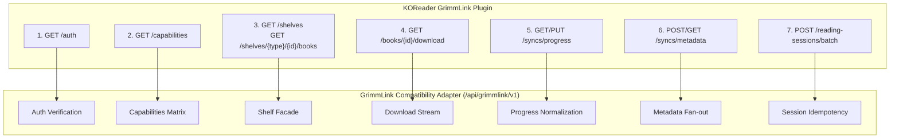

# Legacy GrimmLink Wire Contract Specification

- **Document Version:** `1.0.1`
- **Frozen In Session:** `Session 01 — Freeze Existing GrimmLink Contract`
- **Protocol Namespace:** `/api/grimmlink/v1`
- **Baseline Implementations:**
  - Client: `0xstillb/GrimmLink` (`grimmlink.koplugin`, commit `c6114075917a86d3a5d150f484adfa76a692bd75`)
  - Fork Server: `0xstillb/grimmory` backend (`org.booklore.grimmlink.*`, commit `704f8c26794da923ea8ed96cfb1e6405e43f1241`)
- **Status:** **FROZEN / IMMUTABLE** — Any adapter replacing the fork must adhere strictly to this contract without requiring KOReader plugin alterations.

---

## 1. Executive Summary & Contract Governance

This document freezes the wire-level HTTP API contract between the KOReader GrimmLink client plugin (`grimmlink.koplugin`) and the GrimmLink server endpoint namespace (`/api/grimmlink/v1/**`).

### 1.1 Non-Negotiable Rules
1. **Zero Plugin Alterations:** The KOReader plugin must run unmodified against this contract.
2. **Zero Direct DB Mutations:** All data exchanges occur via HTTP API contracts; no raw database manipulation is permitted.
3. **Strict Authentication:** Every protected endpoint requires either MD5 credentials (`x-auth-user` + `x-auth-key`) or Bearer tokens. Invalid credentials must reject immediately with `401 Unauthorized` without silent success fallback.
4. **Scaffold Fail-Safe:** While endpoints are under active session development, unimplemented reads and mutations must return `501 Not Implemented` and must never claim success or alter local state prematurely.

### 1.2 Field Classification Taxonomy

Each field across request and response payloads is categorized as follows:

| Classification | Definition | Enforcement |
|:---|:---|:---|
| `REQUIRED` | Must be provided by caller or returned by server. | Absence triggers `400 Bad Request` or `422 Unprocessable Entity`. |
| `OPTIONAL` | May be omitted or `null`. Server/client applies default behavior. | Fallback or default applied if missing. |
| `DERIVED` | Computed from other fields (e.g. `fileSize = fileSizeKb * 1024`, percentage from page ratio). | Evaluated dynamically; never stored as separate unverified source of truth. |
| `LEGACY` | Backward-compatibility field retained from older fork or KOReader releases. | Maintained for wire compatibility; new consumers should prefer canonical alternatives. |

---

## 2. Global Wire Invariants & Protocol Conventions

### 2.1 Transport & Headers
- **Base URI:** `http(s)://<host>:<port>/api/grimmlink/v1`
- **Content-Type:** `application/json` (except binary book downloads which stream `application/octet-stream` or book-specific MIME types).
- **Authentication Headers:**
  - `x-auth-user`: `<username>` (`REQUIRED` for MD5 auth)
  - `x-auth-key`: `<32-character hexadecimal MD5 hash of password>` (`REQUIRED` for MD5 auth, case-insensitive comparison)
  - `Authorization`: `Bearer <jwt_token>` (`OPTIONAL` alternative for JWT-based requests)

### 2.2 Timestamps & Units
- **Timestamps:**
  - Standard timestamp: ISO-8601 UTC string (`YYYY-MM-DDTHH:MM:SSZ` or `YYYY-MM-DDTHH:MM:SS.sssZ`).
  - Epoch timestamp: Unix epoch integer in seconds (used in KOReader `timestamp` progress fields).
- **Units:**
  - Progress percentage: `0.0` to `100.0` floating-point percentage on KOReader client wire (internally projected to `0.0` – `1.0` in Official Grimmory database).
  - Rating scale: `1` to `10` integer scale on KOReader GrimmLink wire (translated from/to `1` – `5` star ratings in Official Grimmory).
  - Duration: Integer seconds (`durationSeconds >= 0`).
  - File sizes: `fileSizeKb` in kibibytes (1024 bytes), `fileSize` in bytes (`DERIVED`: `fileSizeKb * 1024`).
  - Page numbers: 1-indexed integers (`currentPage`, `totalPages`, `startPage`, `endPage`).

### 2.3 Error Shapes
The client parses errors using the following precedence:
1. `{"status": "error", "message": "<msg>"}` (Authentication filter shape)
2. `{"status": <int>, "message": "<msg>", "timestamp": "<iso>", "details": [...]}` (Spring Boot GlobalExceptionHandler shape)
3. `{"detail": "<msg>"}` (FastAPI standard error shape)

---

## 2.4 Documented PDF Routes Versus Active Controllers

The pinned fork's [API guide](https://github.com/0xstillb/grimmory/blob/704f8c26794da923ea8ed96cfb1e6405e43f1241/docs/GRIMMLINK-V1-API.md) lists `GET/PUT /books/{bookId}/pdf-progress`. Its [six GrimmLink controllers](https://github.com/0xstillb/grimmory/tree/704f8c26794da923ea8ed96cfb1e6405e43f1241/backend/src/main/java/org/booklore/grimmlink/controller) do not register those routes. The pinned [KOReader client](https://github.com/0xstillb/GrimmLink/blob/c6114075917a86d3a5d150f484adfa76a692bd75/grimmlink.koplugin/grimmlink_api_client.lua) sends PDF progress through the generic `/syncs/progress` routes. The 19 frozen routes describe the implemented controller surface; PDF page semantics remain part of generic progress.

---

## 3. Route Specifications



---

### Route 1: Authentication Verification

- **Method:** `GET`
- **Path:** `/api/grimmlink/v1/auth`
- **Auth:** `x-auth-user` + `x-auth-key` (`REQUIRED`)
- **Description:** Verifies KOReader credentials and user sync eligibility. Used by KOReader **Test Connection**.

#### Request Headers
| Header | Classification | Type | Description |
|:---|:---|:---|:---|
| `x-auth-user` | `REQUIRED` | String | KOReader username |
| `x-auth-key` | `REQUIRED` | String (32 hex) | MD5 hash of user password |

#### Response (`200 OK`)
```json
{
  "status": "ok",
  "username": "koreader_user",
  "userId": 42,
  "syncEnabled": true,
  "syncWithWebReader": true
}
```

#### Response Fields
| Field | Classification | Type | Description |
|:---|:---|:---|:---|
| `status` | `REQUIRED` | String | Must be `"ok"` |
| `username` | `REQUIRED` | String | Resolved user login name |
| `userId` | `REQUIRED` | Integer | Grimmory numeric user ID |
| `syncEnabled` | `OPTIONAL` | Boolean | True if user has KOReader sync active |
| `syncWithWebReader` | `OPTIONAL` | Boolean | True if WebUI reader progress synchronization is enabled |

#### Status Codes & Errors
- `200 OK`: Valid credentials and linked user.
- `401 Unauthorized`: Missing headers, invalid credentials, or unlinked KOReader user.
- `403 Forbidden`: User has `syncEnabled = false`.
- `502 Bad Gateway`: Upstream Official service unreachable.

---

### Route 2: Capabilities Matrix

- **Method:** `GET`
- **Path:** `/api/grimmlink/v1/capabilities`
- **Auth:** Public / None required (`OPTIONAL`)
- **Description:** Advertises supported synchronization features and version matrix.

#### Response (`200 OK`)
```json
{
  "apiVersion": "v1",
  "webUiProgress": true,
  "progressSync": true,
  "pdfBridge": false,
  "readingSessions": true,
  "metadataSync": true,
  "shelves": true
}
```

#### Response Fields
| Field | Classification | Type | Description |
|:---|:---|:---|:---|
| `apiVersion` | `REQUIRED` | String | Protocol version (e.g. `"v1"`) |
| `webUiProgress` | `REQUIRED` | Boolean | True if Web reader progress bridging is active |
| `progressSync` | `REQUIRED` | Boolean | True if progress synchronization is active |
| `pdfBridge` | `REQUIRED` | Boolean | True if PDF bridge conflict engine is active (default `false`) |
| `readingSessions` | `REQUIRED` | Boolean | True if reading session ingestion is active |
| `metadataSync` | `REQUIRED` | Boolean | True if metadata batch ingestion is active |
| `shelves` | `REQUIRED` | Boolean | True if shelf synchronization is active |

---

### Route 3: Book Lookup by Hash

- **Method:** `GET`
- **Path:** `/api/grimmlink/v1/books/by-hash/{bookHash}`
- **Auth:** `x-auth-user` + `x-auth-key` or Bearer (`REQUIRED`)
- **Parameters:**
  - `bookHash` (path, string, `REQUIRED`): MD5 file fingerprint of book.
- **Description:** Resolves a book record and numeric ID from file hash upon opening a book.

#### Response (`200 OK`)
Returns full `OfficialBookDTO` representation:
```json
{
  "id": 42,
  "libraryId": 1,
  "title": "The Count of Monte Cristo",
  "readStatus": "READING",
  "personalRating": 8,
  "primaryFile": {
    "id": 101,
    "bookId": 42,
    "fileName": "The Count of Monte Cristo.epub",
    "bookType": "EPUB",
    "fileSizeKb": 1250
  }
}
```

#### Key Fields
| Field | Classification | Type | Description |
|:---|:---|:---|:---|
| `id` | `REQUIRED` | Integer | Canonical book ID |
| `title` | `OPTIONAL` | String | Book title |
| `primaryFile.id` | `OPTIONAL` | Integer | Canonical file ID |
| `primaryFile.fileSizeKb` | `OPTIONAL` | Integer | File size in KB |

The fork resolves the hash internally. Its `BookFile` response DTO has no `currentHash` or `initialHash` field, so clients must not require either in this response.

---

### Route 4: Book Binary Download

- **Method:** `GET`
- **Path:** `/api/grimmlink/v1/books/{bookId}/download`
- **Auth:** `x-auth-user` + `x-auth-key` or Bearer (`REQUIRED`)
- **Parameters:**
  - `bookId` (path, integer, `REQUIRED`): Canonical book ID.
- **Description:** Binary stream of book file. Plugin writes to `.tmp` file, performs binary signature and size verification, and renames to target filename.
- **Response:** `200 OK` with binary body and `Content-Disposition` header.

---

### Route 5: Read Statuses Directory

- **Method:** `GET`
- **Path:** `/api/grimmlink/v1/books/read-statuses`
- **Auth:** `x-auth-user` + `x-auth-key` or Bearer (`REQUIRED`)
- **Description:** Returns list of supported read statuses.

#### Response (`200 OK`)
```json
{
  "statuses": [
    "UNREAD",
    "READING",
    "READ",
    "PAUSED",
    "ABANDONED",
    "RE_READING"
  ]
}
```

---

### Route 6: Update Book Read Status

- **Method:** `PUT`
- **Path:** `/api/grimmlink/v1/books/{bookId}/status`
- **Auth:** `x-auth-user` + `x-auth-key` or Bearer (`REQUIRED`)
- **Request Body:**
```json
{
  "status": "COMPLETED"
}
```

#### Request Fields
| Field | Classification | Type | Notes |
|:---|:---|:---|:---|
| `status` | `OPTIONAL` | String | Read status. `"ON_HOLD"` normalizes to `"PAUSED"`, `"COMPLETED"` normalizes to `"READ"`. |

#### Response (`200 OK`)
```json
{
  "bookId": 42,
  "status": "COMPLETED",
  "updated": true
}
```

---

### Route 7: Shelves Directory

- **Method:** `GET`
- **Path:** `/api/grimmlink/v1/shelves`
- **Auth:** `x-auth-user` + `x-auth-key` or Bearer (`REQUIRED`)
- **Query Parameters:**
  - `type` (`OPTIONAL`): Shelf type filter (`"regular"` or `"magic"`). If omitted, returns both.

#### Response (`200 OK`)
```json
[
  {
    "id": 1,
    "name": "Fantasy Classics",
    "type": "regular",
    "visibility": "personal",
    "bookCount": 15,
    "description": null
  },
  {
    "id": 100,
    "name": "Unread High Fantasy",
    "type": "magic",
    "visibility": "personal",
    "bookCount": 8,
    "description": "Rule-based Magic Shelf"
  }
]
```

#### Response Item Fields
| Field | Classification | Type | Description |
|:---|:---|:---|:---|
| `id` | `REQUIRED` | Integer | Shelf ID |
| `name` | `REQUIRED` | String | Shelf display name |
| `type` | `REQUIRED` | String | Shelf category: `"regular"` or `"magic"` |
| `visibility` | `OPTIONAL` | String | `"personal"` or `"public"` |
| `bookCount` | `OPTIONAL` | Integer | Total book count in shelf |
| `description` | `OPTIONAL` | String | Description text |

---

### Route 8: Regular Shelf Books (Legacy Route)

- **Method:** `GET`
- **Path:** `/api/grimmlink/v1/shelves/{shelfId}/books`
- **Auth:** `x-auth-user` + `x-auth-key` (`REQUIRED`)
- **Status:** `LEGACY` — Retained for compatibility; delegates to regular shelf handler.

---

### Route 9: Typed Shelf Books

- **Method:** `GET`
- **Path:** `/api/grimmlink/v1/shelves/{shelfType}/{shelfId}/books`
- **Auth:** `x-auth-user` + `x-auth-key` or Bearer (`REQUIRED`)
- **Parameters:**
  - `shelfType` (path, string, `REQUIRED`): `"regular"` or `"magic"`.
  - `shelfId` (path, integer, `REQUIRED`): Numeric shelf ID.
  - `limit` (query, integer, `OPTIONAL`): Page size limit (1–100, default 100).
  - `offset` (query, integer, `OPTIONAL`): 0-indexed element offset.
  - `cursor` (query, string, `OPTIONAL`): Book ID cursor for pagination.

#### Response (`200 OK`)
Array of `GrimmlinkBookSummary` objects:
```json
[
  {
    "bookId": 42,
    "bookFileId": 101,
    "title": "The Count of Monte Cristo",
    "author": "Alexandre Dumas",
    "fileName": "The Count of Monte Cristo.epub",
    "originalFileName": "The Count of Monte Cristo.epub",
    "extension": "epub",
    "fileFormat": "EPUB",
    "fileSizeKb": 1250,
    "fileSize": 1280000,
    "bookHash": "d41d8cd98f00b204e9800998ecf8427e",
    "seriesName": "Classics",
    "seriesNumber": 1.0
  }
]
```

#### Book Summary Fields
| Field | Classification | Type | Description |
|:---|:---|:---|:---|
| `bookId` | `REQUIRED` | Integer | Canonical book ID |
| `bookFileId` | `OPTIONAL` | Integer | Canonical file ID |
| `title` | `OPTIONAL` | String | Book title |
| `author` | `OPTIONAL` | String | Formatted authors (comma-separated) |
| `fileName` | `OPTIONAL` | String | Target file name |
| `extension` | `DERIVED` | String | Lowercase extension (e.g. `"epub"`) |
| `fileFormat` | `OPTIONAL` | String | MIME / enum format (e.g. `"EPUB"`) |
| `fileSizeKb` | `OPTIONAL` | Integer | File size in KB |
| `fileSize` | `DERIVED` | Integer | Bytes (`fileSizeKb * 1024`) |
| `bookHash` | `OPTIONAL` | String | File MD5 fingerprint |
| `seriesName` | `OPTIONAL` | String | Series title if available |
| `seriesNumber` | `OPTIONAL` | Float | Series volume number |

---

### Route 10 & 11: Remove Book from Shelf

- **Method:** `POST`
- **Paths:**
  - `POST /api/grimmlink/v1/shelves/{shelfId}/books/{bookId}/remove` (`LEGACY`)
  - `POST /api/grimmlink/v1/shelves/{shelfType}/{shelfId}/books/{bookId}/remove` (Canonical)
- **Auth:** `x-auth-user` + `x-auth-key` or Bearer (`REQUIRED`)

#### Semantic Invariants
1. **Regular Shelf:** Unassigns book from shelf. Returns `200 OK` with removal status.
2. **Magic Shelf:** **IMMUTABLE RULE-DERIVED**. Manual removal is rejected with `400 Bad Request` or response payload `removed=false, status="unsupported"`.
3. **Multi-Shelf Preservation:** When a book is removed from one shelf, the client and adapter check whether it is tracked in other shelves. If so, local files are **never deleted**.

#### Regular Removal Response (`200 OK`)
```json
{
  "shelfId": 1,
  "bookId": 42,
  "shelfType": "regular",
  "removed": true,
  "status": "removed",
  "message": "Shelf membership removed"
}
```

#### Magic Removal Response (`200 OK` or `400 Bad Request`)
```json
{
  "shelfId": 100,
  "bookId": 42,
  "shelfType": "magic",
  "removed": false,
  "status": "unsupported",
  "message": "Magic Shelf is rule-based and cannot be manually removed from"
}
```

---

### Route 12: Progress Fetch

- **Method:** `GET`
- **Path:** `/api/grimmlink/v1/syncs/progress/{bookHash}`
- **Auth:** `x-auth-user` + `x-auth-key` or Bearer (`REQUIRED`)
- **Parameters:**
  - `bookHash` (path, string, `REQUIRED`): Book file hash.

#### Response (`200 OK`)
```json
{
  "timestamp": 1774526400,
  "bookId": 42,
  "bookFileId": 101,
  "bookHash": "d41d8cd98f00b204e9800998ecf8427e",
  "document": "d41d8cd98f00b204e9800998ecf8427e",
  "fileFormat": "EPUB",
  "percentage": 42.5,
  "progress": "/6/4[chap03]!/4/2/10/1:24",
  "location": "/6/4[chap03]!/4/2/10/1:24",
  "currentPage": null,
  "updatedAt": "2026-09-25T12:00:00Z",
  "device": "Kobo Clara 2E",
  "device_id": "kobo-uuid-12345"
}
```

---

### Route 13: Progress Push

- **Method:** `PUT`
- **Path:** `/api/grimmlink/v1/syncs/progress`
- **Auth:** `x-auth-user` + `x-auth-key` or Bearer (`REQUIRED`)

#### Reflowable Format Request (EPUB)
```json
{
  "document": "d41d8cd98f00b204e9800998ecf8427e",
  "bookHash": "d41d8cd98f00b204e9800998ecf8427e",
  "bookId": 42,
  "bookFileId": 101,
  "fileFormat": "EPUB",
  "progress": "/6/4[chap03]!/4/2/10/1:24",
  "location": "/6/4[chap03]!/4/2/10/1:24",
  "percentage": 42.5,
  "device": "Kobo Clara 2E",
  "deviceId": "kobo-uuid-12345",
  "timestamp": 1774526400
}
```

#### Fixed-Page Request (PDF)
```json
{
  "document": "e99a18c428cb38d5f260853678922e03",
  "bookHash": "e99a18c428cb38d5f260853678922e03",
  "bookId": 88,
  "bookFileId": 205,
  "fileFormat": "PDF",
  "progress": "55",
  "currentPage": 55,
  "totalPages": 250,
  "percentage": 22.0,
  "device": "reMarkable 2",
  "deviceId": "rm2-device-789",
  "timestamp": 1774528000
}
```

#### Semantic Constraints
- For reflowable formats (EPUB), **native location (`location` / `progress`) is strictly REQUIRED**. A purely numeric progress is rejected.
- `percentage` represents `0.0` – `100.0`.

#### Response (`200 OK`)
```json
{
  "status": "progress updated"
}
```

---

### Route 14: Metadata Push

- **Method:** `POST`
- **Path:** `/api/grimmlink/v1/syncs/metadata`
- **Auth:** `x-auth-user` + `x-auth-key` or Bearer (`REQUIRED`)
- **Description:** Pushes user annotations, bookmarks, and personal rating for a book.

#### Request Body
```json
{
  "schemaVersion": 1,
  "syncMode": "push",
  "bookId": 42,
  "bookHash": "d41d8cd98f00b204e9800998ecf8427e",
  "bookFileId": 101,
  "fileFormat": "EPUB",
  "device": "Kobo Clara 2E",
  "deviceId": "kobo-uuid-12345",
  "timestamp": "2026-09-25T15:00:00Z",
  "rating": {
    "dedupeKey": "rating:42:koreader",
    "value": 8,
    "scale": 10,
    "source": "koreader",
    "updatedAt": "2026-09-25T15:00:00Z"
  },
  "annotations": [
    {
      "dedupeKey": "d41d8cd98f00b204e9800998ecf8427e:annotation:1:pos0:hash",
      "type": "highlight",
      "text": "All human wisdom is contained in these two words: Wait and Hope.",
      "note": "Memorable quote",
      "color": "#FFEB3B",
      "drawer": "lighten",
      "style": "highlight",
      "chapter": "Chapter 117",
      "page": 500,
      "location": {
        "pos0": "/6/4[chap117]!/4/2/10/1:0",
        "pos1": "/6/4[chap117]!/4/2/10/1:64",
        "pageno": 500,
        "cfi": "epubcfi(/6/4[chap117]!/4/2/10/1:0)",
        "raw": "/6/4[chap117]!/4/2/10/1:0"
      },
      "createdAt": "2026-09-25T14:50:00Z",
      "updatedAt": "2026-09-25T15:00:00Z"
    }
  ],
  "bookmarks": [
    {
      "dedupeKey": "bookmark:42:500",
      "title": "Important bookmark",
      "notes": "Re-read this section",
      "chapter": "Chapter 117",
      "page": 500,
      "location": {
        "pos0": "/6/4[chap117]!/4/2/10/1:0",
        "pageno": 500,
        "cfi": "epubcfi(/6/4[chap117]!/4/2/10/1:0)"
      },
      "createdAt": "2026-09-25T14:50:00Z",
      "updatedAt": "2026-09-25T15:00:00Z",
      "deleted": false
    }
  ]
}
```

#### Response (`200 OK`)
```json
{
  "bookId": 42,
  "ok": true,
  "results": {
    "rating": {
      "type": "RATING",
      "dedupeKey": "rating:42:koreader",
      "status": "SUCCESS",
      "id": "rating-42"
    },
    "annotations": [
      {
        "type": "ANNOTATION",
        "dedupeKey": "d41d8cd98f00b204e9800998ecf8427e:annotation:1:pos0:hash",
        "status": "SUCCESS",
        "id": "ann-101"
      }
    ],
    "bookmarks": [
      {
        "type": "BOOKMARK",
        "dedupeKey": "bookmark:42:500",
        "status": "SUCCESS",
        "id": "bm-202"
      }
    ]
  }
}
```

---

### Route 15: Metadata Pull

- **Method:** `GET`
- **Path:** `/api/grimmlink/v1/syncs/metadata`
- **Auth:** `x-auth-user` + `x-auth-key` or Bearer (`REQUIRED`)
- **Query Parameters:**
  - `bookId` (`OPTIONAL`): Numeric book ID.
  - `bookHash` (`OPTIONAL`): Book hash identifier.
  - `bookFileId` (`OPTIONAL`): Book file ID.
  - `since` (`LEGACY`): ISO-8601 timestamp cutoff.
  - `cursor` (`OPTIONAL`): ISO-8601 pagination cursor.
  - `limit` (`OPTIONAL`): Batch size (default 50, max 500).
  - `type` (`OPTIONAL`): `"rating"`, `"bookmark"`, or `"annotation"`.

#### Response (`200 OK`)
```json
{
  "bookId": 42,
  "bookFileId": 101,
  "ok": true,
  "since": "2026-09-20T00:00:00Z",
  "nextCursor": "2026-09-25T15:00:00Z",
  "limit": 50,
  "items": [
    {
      "id": "grimmory-personal-rating",
      "type": "rating",
      "bookId": 42,
      "bookFileId": 101,
      "dedupeKey": "grimmory-personal-rating:8",
      "payload": {
        "value": 8,
        "scale": 10,
        "source": "grimmory-web"
      },
      "device": "Grimmory Web",
      "updatedAt": "2026-09-25T15:00:00Z"
    }
  ]
}
```

---

### Route 16: Metadata Batch Push/Pull

- **Method:** `POST`
- **Path:** `/api/grimmlink/v1/syncs/metadata/batch`
- **Auth:** `x-auth-user` + `x-auth-key` or Bearer (`REQUIRED`)
- **Description:** Combines metadata push and incremental pull into a single round-trip.
- **Request:** Same as `POST /syncs/metadata` with `syncMode: "incremental"`.

#### Response (`200 OK`)
```json
{
  "ok": true,
  "push": {
    "bookId": 42,
    "ok": true,
    "results": {
      "rating": {
        "type": "RATING",
        "dedupeKey": "rating:42:koreader",
        "status": "SUCCESS",
        "id": "rating-42"
      },
      "annotations": [],
      "bookmarks": []
    }
  },
  "pull": {
    "bookId": 42,
    "bookFileId": 101,
    "ok": true,
    "since": "2026-09-20T00:00:00Z",
    "nextCursor": "2026-09-25T15:00:00Z",
    "limit": 50,
    "items": []
  }
}
```

---

### Route 17: Reading Sessions History

- **Method:** `GET`
- **Path:** `/api/grimmlink/v1/reading-sessions`
- **Auth:** `x-auth-user` + `x-auth-key` or Bearer (`REQUIRED`)
- **Query Parameters:**
  - `bookId` (`REQUIRED`): Target book ID.
  - `limit` (`OPTIONAL`): Max sessions to return (1–100, default 50).

#### Response (`200 OK`)
```json
[
  {
    "id": 1,
    "bookId": 42,
    "bookTitle": "The Count of Monte Cristo",
    "bookType": "EPUB",
    "startTime": "2026-09-25T14:00:00Z",
    "endTime": "2026-09-25T15:00:00Z",
    "durationSeconds": 3600,
    "startProgress": 40.0,
    "endProgress": 42.5,
    "progressDelta": 2.5,
    "startLocation": "/6/4[chap03]!/4/2/8/1:0",
    "endLocation": "/6/4[chap03]!/4/2/10/1:24",
    "createdAt": "2026-09-25T15:00:05"
  }
]
```

---

### Route 18: Record Single Reading Session

- **Method:** `POST`
- **Path:** `/api/grimmlink/v1/reading-sessions`
- **Auth:** `x-auth-user` + `x-auth-key` or Bearer (`REQUIRED`)
- **Description:** Records a single reading session. Fallback when batch API is unavailable. The fork requires `bookId`, `startTime`, `endTime`, and `durationSeconds`.

#### Request Body
```json
{
  "bookId": 42,
  "bookType": "EPUB",
  "bookHash": "d41d8cd98f00b204e9800998ecf8427e",
  "device": "Kobo Clara 2E",
  "deviceId": "kobo-uuid-12345",
  "startTime": "2026-09-25T14:00:00Z",
  "endTime": "2026-09-25T15:00:00Z",
  "durationSeconds": 3600,
  "durationFormatted": "1:00:00",
  "startProgress": 40.0,
  "endProgress": 42.5,
  "progressDelta": 2.5,
  "startLocation": "/6/4[chap03]!/4/2/8/1:0",
  "endLocation": "/6/4[chap03]!/4/2/10/1:24",
  "currentPage": 120,
  "totalPages": 300
}
```

#### Response (`202 Accepted`)
HTTP status `202 Accepted` with empty body.

---

### Route 19: Record Batch Reading Sessions

- **Method:** `POST`
- **Path:** `/api/grimmlink/v1/reading-sessions/batch`
- **Auth:** `x-auth-user` + `x-auth-key` or Bearer (`REQUIRED`)
- **Description:** Primary session upload endpoint. Requires `bookId`, a nonempty `sessions` array (maximum 500), and `durationSeconds` on each item. The server applies duplicate detection. The nested items also require `startTime` and `endTime`.

#### Request Body
```json
{
  "bookId": 42,
  "bookHash": "d41d8cd98f00b204e9800998ecf8427e",
  "bookType": "EPUB",
  "device": "Kobo Clara 2E",
  "deviceId": "kobo-uuid-12345",
  "sessions": [
    {
      "startTime": "2026-09-25T14:00:00Z",
      "endTime": "2026-09-25T14:30:00Z",
      "durationSeconds": 1800,
      "durationFormatted": "30m 0s",
      "startProgress": 40.0,
      "endProgress": 41.2,
      "progressDelta": 1.2,
      "startLocation": "/6/4[chap03]!/4/2/8/1:0",
      "endLocation": "/6/4[chap03]!/4/2/9/1:10"
    }
  ]
}
```

#### Response (`200 OK`)
```json
{
  "totalRequested": 1,
  "successCount": 1,
  "results": [
    {
      "index": 0,
      "sessionId": 101,
      "status": "created",
      "startTime": "2026-09-25T14:00:00Z",
      "endTime": "2026-09-25T14:30:00Z"
    }
  ]
}
```

#### Duplicate Detection Rule
Idempotency is evaluated on `(userId, bookId, bookHash, startTime, endTime, deviceId)`. If matched, `status` returns `"duplicate"`, `sessionId` references the original session, and `successCount` is incremented.

---

## 4. Contract Verification Matrix

| Route | Primary Method | Path | Auth Type | Invariant Check | Scaffold State |
|:---|:---|:---|:---|:---|:---|
| Auth | `GET` | `/auth` | MD5 | Immediate 401 on bad credentials | **ACTIVE** |
| Capabilities | `GET` | `/capabilities` | None | Lists feature flags; mutations false in scaffold | **ACTIVE** |
| Book by Hash | `GET` | `/books/by-hash/{hash}` | MD5/Bearer | Access check before lookup | **501** (S03) |
| Download | `GET` | `/books/{id}/download` | MD5/Bearer | Streaming response, safe rename | **501** (S03) |
| Read Statuses | `GET` | `/books/read-statuses` | MD5/Bearer | Returns 6 standard statuses | **501** (S03) |
| Read Status Update | `PUT` | `/books/{id}/status` | MD5/Bearer | Status normalization | **501** (S03) |
| Shelves List | `GET` | `/shelves` | MD5/Bearer | Regular + Magic unified | **501** (S04) |
| Shelf Books | `GET` | `/shelves/{type}/{id}/books` | MD5/Bearer | Pagination & BookSummary | **501** (S04) |
| Shelf Removal | `POST` | `/shelves/{type}/{id}/books/{b}/remove` | MD5/Bearer | Magic shelf removal rejected; multi-shelf protected | **501 Regular / 400 Magic** |
| Progress Get | `GET` | `/syncs/progress/{hash}` | MD5/Bearer | Unit scale 0-100% | **501** (S06) |
| Progress Put | `PUT` | `/syncs/progress` | MD5/Bearer | Native location required for EPUB | **501** (S06) |
| Metadata Push | `POST` | `/syncs/metadata` | MD5/Bearer | Rating 1-10, CFI, Dedupe | **501** (S07) |
| Metadata Pull | `GET` | `/syncs/metadata` | MD5/Bearer | Cursor pagination | **501** (S07) |
| Metadata Batch | `POST` | `/syncs/metadata/batch` | MD5/Bearer | Push + Pull combined | **501** (S07) |
| Sessions Get | `GET` | `/reading-sessions` | MD5/Bearer | Limit 1-100 | **501** (S08) |
| Session Single | `POST` | `/reading-sessions` | MD5/Bearer | 202 Accepted | **501** (S08) |
| Session Batch | `POST` | `/reading-sessions/batch` | MD5/Bearer | Idempotency by 6-tuple | **501** (S08) |
